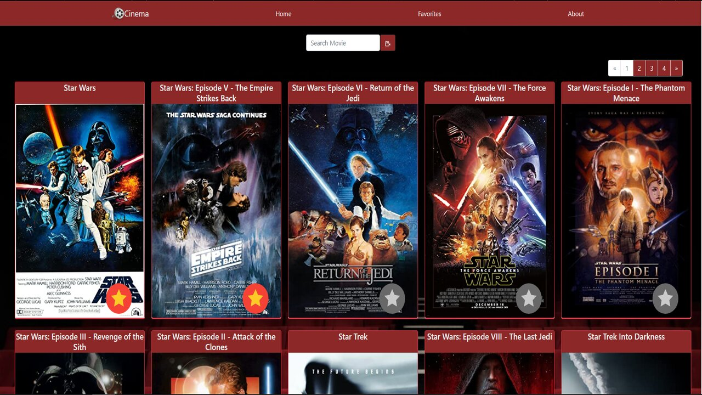
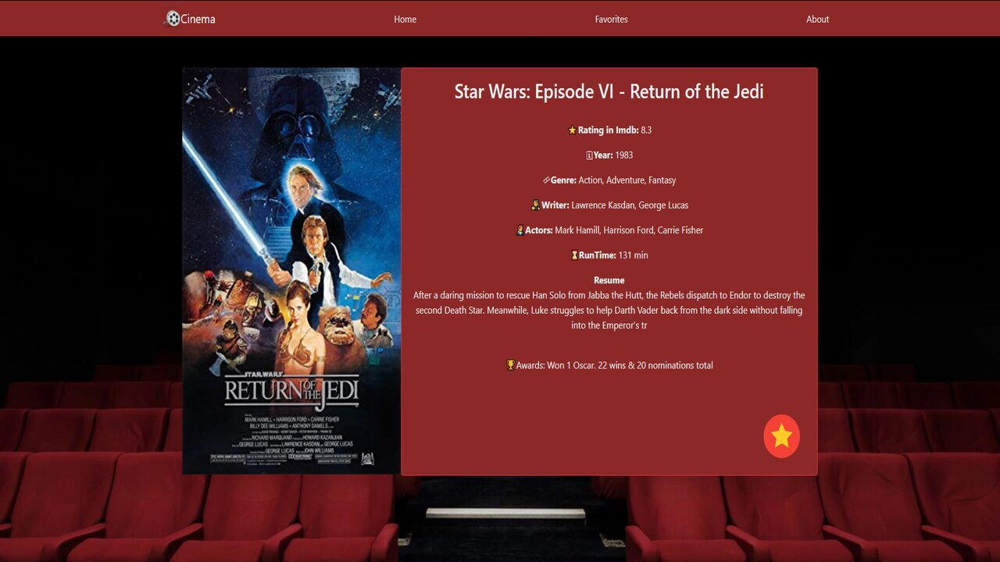
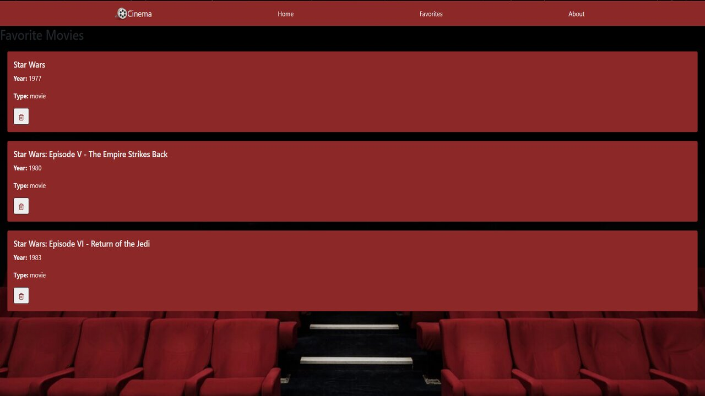

    

# Cinema-Movies
- Proyecto realizado para fines practicos durante el Bootcamp [Soy Henry](https://www.soyhenry.com/) 
- Debía realizar un sitio web de series y películas. Donde renderice las mismas y pueda buscarlas por nombre y también ver sus detalles. Además, poder agregarlas y eliminarlas de una lista de favoritos.
Los estilos en este proyecto fueron realizados con Bootstrap y es full responsive.
- [LINK](https://moviescinema-app.vercel.app/)

## Tecnologías utilizadas :computer: 

* __Javascript__
* __React - Redux__
* __Bootstrap__
 

## Previews 🎬

    

    

    

